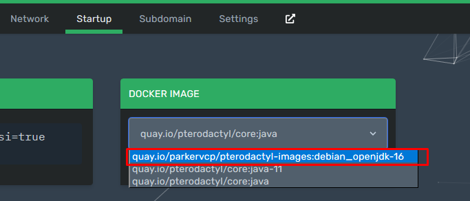
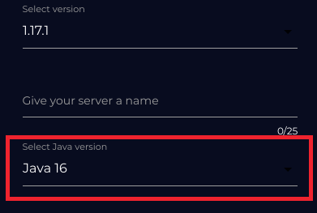
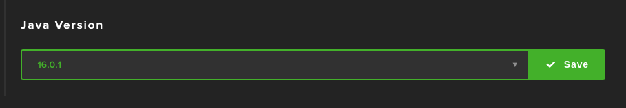
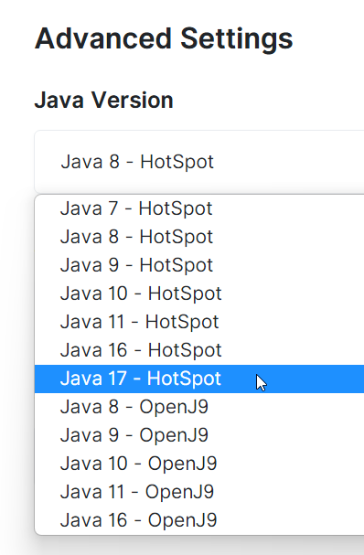
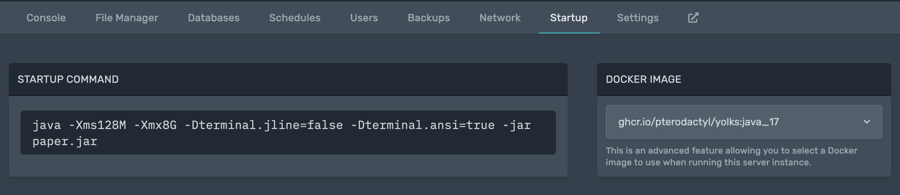

===================
Updating to Java 17
===================

Paper will only support Java 17 and above because of Mojang Studios deciding
to bump their own Java requirement with 1.18.

If you're a developer or want to be on the safe side, pick the JDK options in
the guides instead of a generic JRE. The JDK contains the JRE, in addition to
development material (sources, documentation, a reference compiler, and more).

The RPM, Ubuntu/Debian and Windows instructions below use Amazon Corretto
as OpenJDK vendor.
It's worth to note that Corretto is not the only OpenJDK vendor to choose from,
you are free to use a different one like `Azul Zulu <https://www.azul.com/>`_ or
`Microsoft <https://www.microsoft.com/openjdk>`_.

To update, please find the appropriate header for you in the table of contents.

.. contents::
    :depth: 2
    :local:

.. We don't want text to appear right underneath images: this is ugly.
   Licensed under CC BY-SA 4.0, found 2021-06-05 on: https://stackoverflow.com/a/54412348

.. |br| raw:: html

    

.. |#paper-help| replace:: ``#paper-help`` on Discord
.. _#paper-help: https://discord.gg/papermc

Shared hosts
============

If you cannot find your host in the following list, you should open a support
ticket with your host's website to ask how to update.

.. Bonus: You can PR a guide for the host you represent, or contact the Paper
   team if you'd like your guide in this list. Remember they must be in
   alphabetical order: we do not wish to order any hosts in any significant way.

Apex Hosting
~~~~~~~~~~~~

Apex Hosting chooses the correct Java version for both Paper and Waterfall
per default. You don't need to do anything to update.

Aternos
~~~~~~~

If you run Paper, you have the correct Java version set automatically.

|br|

Bloom.Host
~~~~~~~~~~

Bloom.Host selects the correct Java version per default.
You don't need to do anything to update.

|br|

Creeper.Host
~~~~~~~~~~~~

CreeperHost has some terrific documentation on how to do this on their website:
`Changing Java Version <https://wiki.creeper.host/books/minecraft-java-edition/page/changing-java-version>`_.

DedicatedMC
~~~~~~~~~~~

When loading Minecraft 1.18, the server will automatically be set to Java 17,
and you don't need to do anything whatsoever. If you wish to test Java 17 before
updating, you can set this yourself in the *Startup Settings* panel:

|br|

For more information, feel free to read the `How to change your server's Java
version <https://docs.dedicatedmc.io/server-setup/how-to-change-your-servers-java-version/>`_
guide on their wiki.

EnviroMC
~~~~~~~~

EnviroMC defaults to Java 16 if you select Paper as your server jar.
To manually change your Java version, please navigate to the
*Startup -> Docker Image* option, and select ``Java 16``, as shown below.

|br|

MCProHosting
~~~~~~~~~~~~

When loading 1.17, the server will automatically be set to Java 16 and you don't
have to do anything whatsoever. If you want to test Java 16 on Minecraft 1.16 or
earlier, you will need to set the server type to *Snapshot*, then put Paper back
on the server manually.

Minehub
~~~~~~~~~~~~

Minehub will automatically set the Java version to Java 16 when selecting 1.17.
You can also set the Java version yourself under ``Select Java version``.

|br|

Nitrado
~~~~~~~

If you create a 1.17 server the Java version will be set to Java 16 out
of the box. However if it doesn't (because e.g. you upgraded the server manually)
you can set the Java version under "General" -> "Java".

|br|

|br|

PebbleHost
~~~~~~~~~~

PebbleHost's knowledgebase has a great article `Does PebbleHost support Java 16?
<https://help.pebblehost.com/en/article/does-pebblehost-support-java-11-java-16-1f5zlk2/>`_
on their website to show how to change the Java version, along with
incompatibilities with certain versions, but they will provide the correct version automatically.

ServerFlex
~~~~~~~~~~

ServerFlex defaults to Java 8, but will automatically select Java 16
where appropriate. To manually configure the java version, navigate
to the settings page, and select ``Java Version``. More information can be found
`in ServerFlex's support article. <https://serverflex.io/help/article/change-java-version-on-minecraft-server>`_

|br|

Server.pro
~~~~~~~~~~

Creating a server on 1.18 automatically selects Java 17.
To manually set the Java version, navigate to the control panel,
select ``Advanced Settings`` and select ``Java 17 - HotSpot``
on the dropdown menu. Save the changes by clicking ``Save Changes``
at the bottom of the page.

.. image:: java-update-assets/serverpro-panel.png
  :width: 300

|br|

|br|

WinterNode
~~~~~~~~~~

WinterNode's Help Center has an helpful article `Java Version Selector
<hhttps://help.winternode.com/Java-Version-Selection-c0ab39f51ab147de9b1125418e001fab>`_
showing how to change the Java version, along with recommendations per Minecraft
version. If you do nothing, it will automatically select the version that fits
best for your server.

Pterodactyl
===========

.. note::

    To switch the Java version on Pterodactyl on a version lower than v1.2.0, 
    you will require an administrator account. On versions later than v1.2.0,
    you can select it in the ``Startup`` tab.

.. note::

    The names of options will be different depending on the language you use.

Assuming you are already logged in on your administrator account, open the
administrator control panel, go to the *Servers* tab, click on your server
(this has to be repeated for every server you wish to switch the Java version
of), and press the *Startup* tab.

Proceed by selecting ``ghcr.io/pterodactyl/yolks:java_17`` from the *Image*
dropdown under *Docker Container Configuration*.
If you are running an older panel version, manually enter the image url in the custom image field.

|br|

Debian/Ubuntu
=============

To install Java 17 on Debian, Ubuntu, and the plethora of other distributions
based on these, execute the following commands to add the Corretto apt
repository and to install OpenJDK Hotspot:

.. code-block:: console

    $ wget -O- https://apt.corretto.aws/corretto.key | sudo apt-key add -
    $ sudo add-apt-repository 'deb https://apt.corretto.aws stable main'
    $ sudo apt-get update
    $ sudo apt-get install -y java-17-amazon-corretto-jdk

RPM-Based
=========

To install Java 17 on CentOS, RHEL, Fedora, openSUSE, SLES and many other RPM-based
distributions, execute the following commands to add Amazon Corretto's
RPM repository and install Java 17.

.. tabs::

  .. tab:: DNF

    .. code-block:: console

      $ sudo rpm --import https://yum.corretto.aws/corretto.key
      $ sudo curl -Lo /etc/yum.repos.d/corretto.repo https://yum.corretto.aws/corretto.repo
      $ sudo dnf -y install java-17-amazon-corretto-devel

  .. tab:: zypper

    .. code-block:: console

      $ sudo zypper addrepo https://yum.corretto.aws/corretto.repo
      $ sudo zypper refresh
      $ sudo zypper install java-17-amazon-corretto-devel

  .. tab:: yum

    .. code-block:: console

      $ sudo rpm --import https://yum.corretto.aws/corretto.key
      $ sudo curl -Lo /etc/yum.repos.d/corretto.repo https://yum.corretto.aws/corretto.repo
      $ sudo yum -y install java-17-amazon-corretto-devel

Arch Linux
==========

.. code-block:: console

   $ sudo pacman -Syu jdk-openjdk

To switch between available Java versions on the system with the archlinux-java
tool, see the wiki on `Switching between JVMs <https://wiki.archlinux.org/title/Java#Switching_between_JVM>`_.

Linux (Generic)
===============

.. note::

    You should check with your distribution's package manager(s) before using
    this section of the guide. It is very likely you can find a suitable Java
    version if you search its repositories for ``java``, ``openjdk``, and
    ``jre``.

SDKMAN!
~~~~~~~

Install SDKs with ease! Wa-pow! Luckily *SDKMAN!* is written in ``bash``, so you
can use this on practically any Linux (and BSD!) environment. Follow the
`installation instructions <https://sdkman.io/install>`_ on their website.

You can then proceed to install one of their many Java distributions with the
`simple commands on their website <https://sdkman.io/jdks>`_.

Adoptium
~~~~~~~~

.. note::

    This assumes an intermediate to advanced Linux user. Ask for help if you
    need it; we don't want you to harm your system. |#paper-help|_ is a fitting
    channel for asking, and remember: `don't ask to ask, just ask
    <https://dontasktoask.com/>`_.

.. note::

    You are going to require the ``tar`` and ``sha256sum`` tools to do this install.

First, select an appropriate ``tar.gz`` file from `Adoptium's website
<https://adoptium.net/releases.html?variant=openjdk17&jvmVariant=hotspot>`_,
and copy the download URL.

Next, figure out which directory you want to install Java to; this is commonly a
subdirectory within ``/usr/lib/jvm``. The tar file you copied the URL to has an
inner directory, so you don't need to create one yourself.

Download the file with one of the following commands:

* With ``curl``: ``curl -LJO "replace this text with the URL"``
* With ``wget``: ``wget "replace this text with the URL"``

And get the signature from pressing the ``Checksum (SHA256)`` button next to the
``.tar.gz`` download button. This should be the same as displayed in the second
column, output from running ``sha256sum "the downloaded file path goes here"``.
If they are not the same, delete the files and re-download them.

Next up, extract the file with: ``tar xzf "the downloaded file path goes
here"``. There should now be a directory named something like ``jdk-17.0.1+12/``.
You can safely delete the ``tar.gz`` file if this is the case.

Now you should add an environment variable called ``JAVA_HOME`` pointing to the
directory you created (e.g. ``/usr/lib/jvm/jdk-17.0.1+12``; note there is no
trailing slash here):

.. code-block:: console

    # cat <<EOF | tee /etc/profile.d/java.sh
    export JAVA_HOME=/usr/lib/jvm/jdk-17.0.1+12
    export PATH=$JAVA_HOME/bin:"$PATH"
    EOF
    # chmod +x /etc/profile.d/java.sh

.. note::

    The ``#`` at the start means this has to be run as either ``root``, or an
    account that has access to the ``/etc/profile.d/`` directory. To avoid this,
    you can replace ``tee`` with ``sudo tee`` (or ``doas tee`` on BSD),
    and replace ``chmod`` with ``sudo chmod`` (or ``doas chmod`` on BSD).

You must now source the new file you created, which is usually done at the start
of a shell, so you can just re-open the shell. Alternatively, run ``source
/etc/profile.d/java.sh``.

Windows 10 & 11
===============

If you're on Windows 10 or 11, you can download Corretto's JDK. You can find the
``msi`` file you should install on `their website
<https://corretto.aws/downloads/latest/amazon-corretto-17-x64-windows-jdk.msi>`_.

Remember to reboot your computer after installing.

Checking version
~~~~~~~~~~~~~~~~

If you now open a new PowerShell prompt and do ``java -version``, it should say
something along the lines of:

.. code-block::

    openjdk version "17" 2021-09-14 LTS
    OpenJDK Runtime Environment Corretto-17.0.0.35.1 (build 17+35-LTS)
    OpenJDK 64-Bit Server VM Corretto-17.0.0.35.1 (build 17+35-LTS, mixed mode, sharing)

It is the ``version "17"`` part that is important -- if the first number is
not ``17``, you need to modify your ``PATH``.

Modifying your ``PATH``
~~~~~~~~~~~~~~~~~~~~~~~

Press your Windows button and search (just start typing) ``environment
variable``. The ``Edit the system environment variables`` result is the one
you want.

|br|

Press the ``Environment Variables...`` button:

|br|

Select the ``JAVA_HOME`` variable in the ``System variables`` section in the
*bottom half* of the window and press ``Edit...``, OR
if the variable is not present, create a new variable with ``New...`` in the
*lower* half of the window, and name it ``JAVA_HOME``. You now want to ``Browse
Directory...`` and find the Java directory under ``C:\Program
Files\Amazon Corretto`` in the Windows Explorer window:

|br|

Now go to your ``Path`` variable in the ``System variables`` section in the
*bottom half* of the window and press ``Edit...``.
If there is already a ``%JAVA_HOME%\bin`` entry in the list, skip this step.
Otherwise, press the ``New`` button at the top and enter ``%JAVA_HOME%\bin``:

|br|

If you now open a new PowerShell window, you should have the correct output. If
not, restart your computer and try again. If it is still wrong, ask for help in
|#paper-help|_ to get further assistance.

macOS / OS X
============

If you're on macOS, you can use a tool called `Homebrew <https://brew.sh/>`_ to
install Java. Follow the `instructions on their website
<https://docs.brew.sh/Installation>`_ for how to install it.

To now install Java, open your Terminal app and run the following command:

.. code-block:: console

    $ brew install openjdk

If you used AdoptOpenJDK previously, uninstall and untap it.

.. code-block:: console

    $ brew uninstall adoptopenjdk16-jre
    $ brew untap AdoptOpenJDK/openjdk
